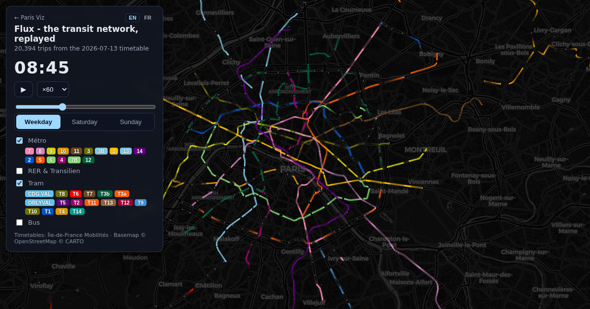
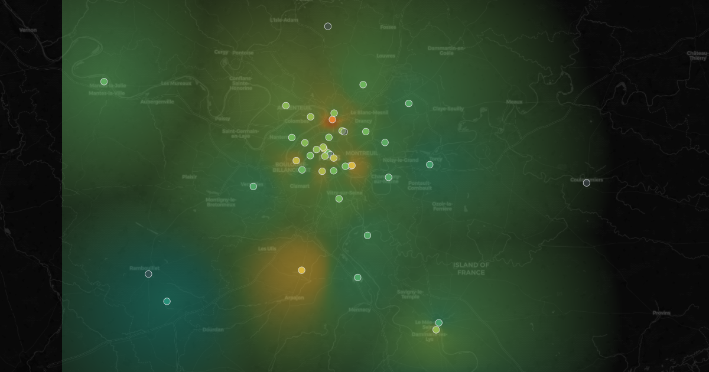
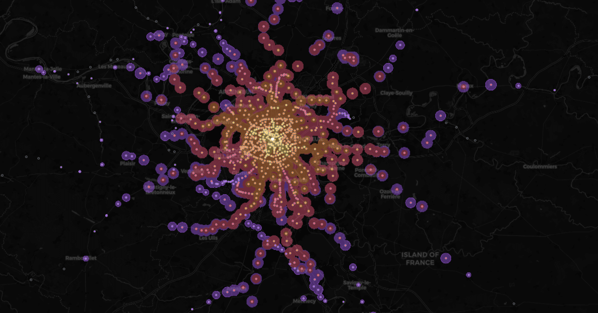
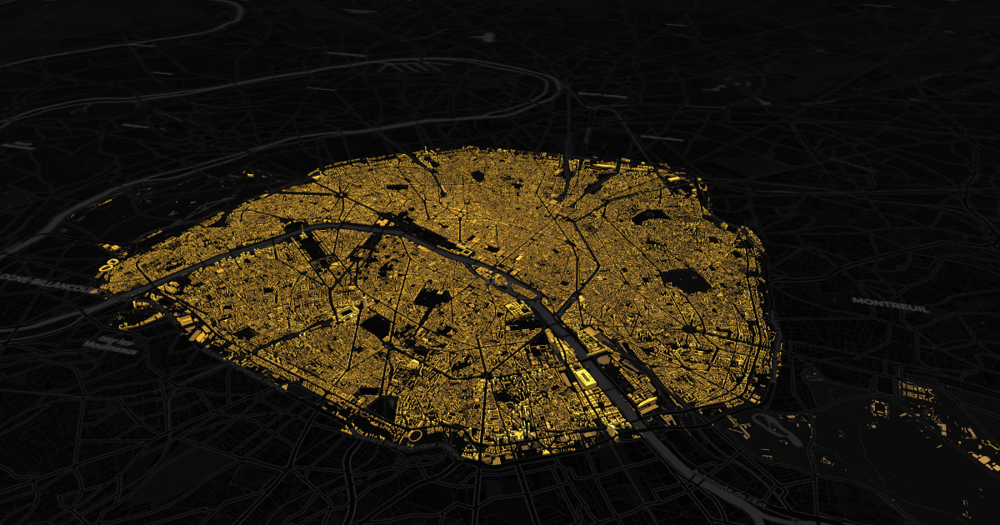
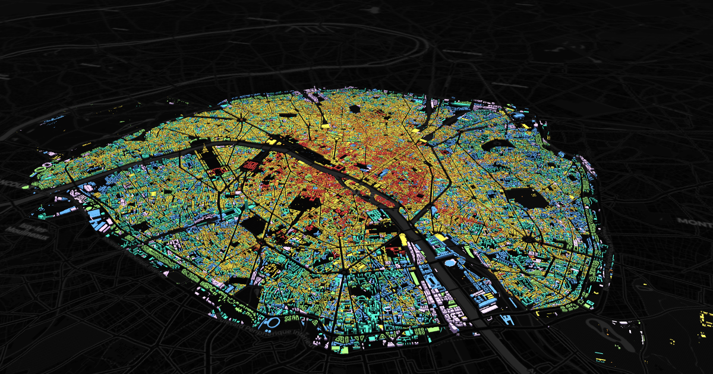
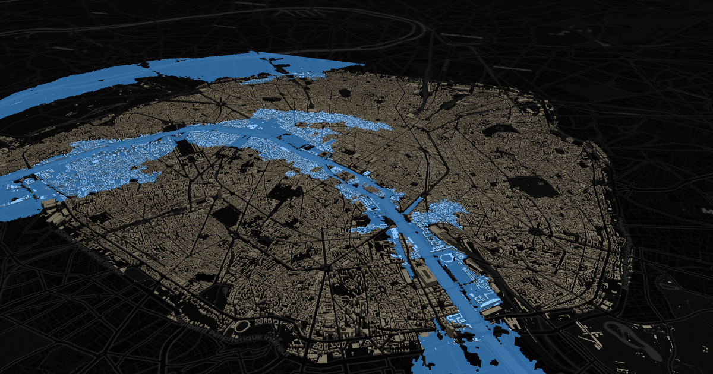
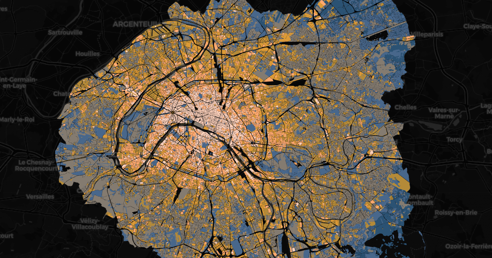
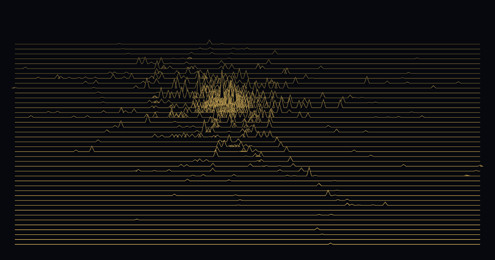

# Paris Viz

Interactive visualizations of Paris / Île-de-France open data, live at
**[parisviz.com](https://parisviz.com)**. pnpm monorepo:

```
apps/site/        Next.js site - each visualization is a route
packages/gtfs/    shared IDFM GTFS utilities (streaming parse of the 150 MB feed)
```

Every visualization follows the same pattern: **source → build script →
static artifact → page**. No database, no backend - data is precomputed by
scripts in `apps/site/scripts/` (run with tsx, consuming `@paris-viz/gtfs`)
into small static files under `apps/site/public/`, and rendered client-side.

## Visualizations

Each one has a full write-up in `docs/` covering the interactions, URL
params, the data pipeline, and the artifact format.

### [`/flux` - the transit network in motion](docs/flux.md)



Every scheduled trip of a full service day moving across the map: ~20,000
métro, RER and tram runs as glowing comets on real track geometry, plus
90,000 buses one checkbox away. [Read more →](docs/flux.md) · [open live](https://parisviz.com/flux)

### [`/air` - a year of Paris air, hour by hour](docs/air.md)



Seven years of hourly Airparif measurements breathing over the map as an
interpolated veil: winter smog, clean windy days, and the March 2020
lockdown clearing the sky in a week. [Read more →](docs/air.md) · [open live](https://parisviz.com/air)

### [`/horizon` - how far can you get?](docs/horizon.md)



Animated isochrones over the rail network: pick any of ~940 stations and
watch 75 minutes of travel ripple outward in 15-minute bands, transfers and
walking included. [Read more →](docs/horizon.md) · [open live](https://parisviz.com/horizon)

### [`/vertige` - how tall is Paris?](docs/vertige.md)



Every building inside the périphérique in 3D at its IGN-measured height:
a rising ceiling assembles the city floor by floor until only the towers
are left climbing. [Read more →](docs/vertige.md) · [open live](https://parisviz.com/vertige)

### [`/strates` - how old is Paris?](docs/strates.md)



Every building inside the périphérique colored by construction period and
assembled year by year: the medieval core, the 1851-1914 explosion that
built half of Paris, then the concrete century. Dating by the Apur.
[Read more →](docs/strates.md) · [open live](https://parisviz.com/strates)

### [`/crue` - the Seine rising](docs/crue.md)



Raise the Seine through the 3D city over the real IGN terrain: the quays go
under at 6 m on the Austerlitz gauge, and at 8.62 m the flood of 1910
returns. A connectivity-aware flood fill, checked against history.
[Read more →](docs/crue.md) · [open live](https://parisviz.com/crue)

### [`/canicule` - the heat island](docs/canicule.md)



39,000 blocks of Paris and the petite couronne scored for heat by the
Institut Paris Region: the dense mineral city glows long after dark while
parks and rivers stay cool, and the vulnerability view shows who cannot
escape it. [Read more →](docs/canicule.md) · [open live](https://parisviz.com/canicule)

### [`/relief` - the ridership landscape](docs/relief.md)



Every rail station of Île-de-France rising from its real place on the map
as a golden spike, its height the ticket validations per hour, breathing
through the day: a calm sea at 3am, ranges along the RER at 8:30, La
Défense towering over the west at 6pm. [Read more →](docs/relief.md) · [open live](https://parisviz.com/relief)

### [`/noctilien` - night-bus frequency](docs/noctilien.md)


Heatmap of night-bus service after midnight: which neighbourhoods the
Noctilien network covers, weeknights vs weekends, with address search and
walking times. [Read more →](docs/noctilien.md) · [open live](https://parisviz.com/noctilien)

## Develop

```bash
pnpm install
pnpm build             # generates missing data artifacts, then next build
pnpm dev               # http://localhost:3000 (run `pnpm build:flow` +
                       # `pnpm build:noctilien` once first to create the data)
pnpm test              # Playwright smoke suites (external services mocked)
```

**Data artifacts are not committed.** `apps/site/scripts/ensure-data.mjs`
generates them during the build when missing. On Vercel the source downloads
(IDFM GTFS ~160 MB, Airparif CSVs) are cached in `.next/cache` between
builds, so ordinary deploys skip the downloads and survive upstream outages;
cached sources older than 5 days are re-fetched, which is what makes the
twice-monthly refresh pick up new data. The
scheduled workflow (`.github/workflows/refresh-data.yml`) just pings a Vercel
Deploy Hook on the 1st and 15th - the feed only covers ~30 days. It needs the
`VERCEL_DEPLOY_HOOK` repository secret (Vercel → Settings → Git → Deploy
Hooks). CI caches the GTFS zip per month.

CI runs the smoke suite on every push and pull request. Tests pin `/flux` to
the smallest mode, paused, and assert on DOM state only - CI runners have no
GPU, so painted WebGL pixels are never asserted.

## Data sources

- [IDFM GTFS](https://transport.data.gouv.fr/datasets/reseau-urbain-et-interurbain-dile-de-france-mobilites) - schedules for all Île-de-France transit (~30-day window)
- [Airparif](https://www.airparif.fr) - hourly NO2 and PM2.5 measurements, with the [LCSQA](https://www.lcsqa.org) station referential
- [IGN BD TOPO](https://geoservices.ign.fr/bdtopo) - building footprints and measured heights, via the Géoplateforme WFS
- [opendata.paris.fr](https://opendata.paris.fr) - arrondissement boundaries (the vertige city-limit clip)
- [Base Adresse Nationale](https://adresse.data.gouv.fr) - geocoding for the noctilien address search
- Basemap: CARTO dark tiles © OpenStreetMap contributors
