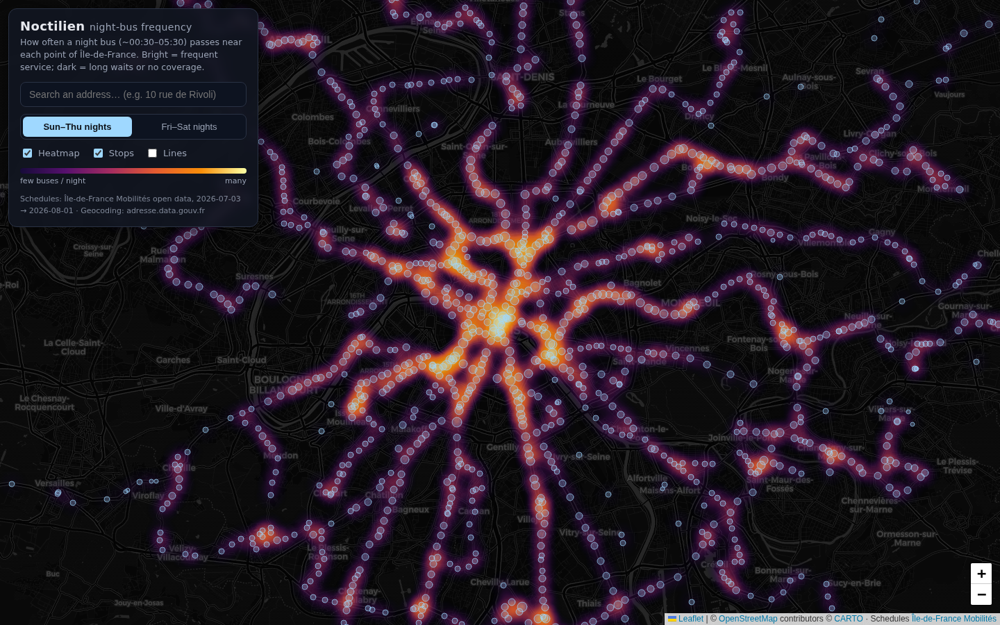

# Noctilien Frequency Map

Interactive map of the **Noctilien** night-bus network of Paris / Île-de-France
(~00:30–05:30, when the métro is closed). A heatmap shows how many night buses
pass near each point per night, so you can see at a glance which areas are well
served, which mean a long wait, and which have no night coverage at all.



## Features

- **Frequency heatmap** — each stop glows proportionally to its Noctilien
  departures per night (all lines, both directions). Dark = no coverage.
- **Sun–Thu vs Fri–Sat toggle** — weekend nights have much denser service.
- **Address search** — type any address (French national address base), the map
  flies there, drops a pin, and lists the 5 nearest stops with walking distance
  and typical wait.
- **Stops layer** — click any stop for its lines and per-night frequency.
- **Lines layer** — the 57 Noctilien routes in their official colors. Click a
  route on the map (or a line badge in any popup) to highlight it and frame it.
- **Shareable URLs** — map view, night type, highlighted line and searched
  address all live in the URL hash, so any situation can be linked.
- **French UI by default**, with an EN toggle (persisted).

## Stack

Next.js (App Router, TypeScript) + Leaflet on a CARTO dark basemap; the
heatmap is precomputed into a Web-Mercator image overlay for smooth pan/zoom.
No backend: all data is preprocessed into `public/noctilien.json` (~640 KB)
and fetched by the client.

```bash
pnpm install
pnpm dev          # http://localhost:3000
pnpm build        # production build (what Vercel runs)
pnpm test         # Playwright smoke suite (hermetic — external services mocked)
```

CI runs the smoke suite on every push and pull request.

## Data

| What | Source |
|---|---|
| Schedules, routes, stops | [IDFM GTFS feed](https://transport.data.gouv.fr/datasets/reseau-urbain-et-interurbain-dile-de-france-mobilites) (all Île-de-France transit, schedules for the next ~30 days) |
| Geocoding | [api-adresse.data.gouv.fr](https://adresse.data.gouv.fr/api-doc/adresse) (called from the browser, no key) |
| Basemap | CARTO dark-matter tiles, © OpenStreetMap contributors |

### Refreshing the data

The feed only covers ~30 days ahead. A GitHub Actions workflow
(`.github/workflows/refresh-data.yml`) regenerates and commits
`public/noctilien.json` on the 1st and 15th of each month (free on public
repos), which triggers a Vercel redeploy. It can also be run manually from the
Actions tab, or locally:

```bash
rm -rf data/            # drop the cached feed
pnpm build:data         # downloads ~150 MB, writes public/noctilien.json
```

The script (`scripts/build-data.ts`, requires the `unzip` CLI) filters the
region-wide feed down to Noctilien lines (`route_short_name` matching
`N\d{2,3}`), attributes every departure to the night it belongs to (GTFS
encodes after-midnight trips both as `25:30` on the previous day and as `01:30`
on the same day), splits Sun–Thu from Fri–Sat nights, merges directional stop
poles within 150 m, and simplifies route shapes to ~5 m tolerance.

**Methodology note:** a stop's "departures per night" counts every Noctilien
passing in either direction, averaged over all nights of that type in the feed
window. Headway shown is the night's service span divided by that count — a
"typical wait between buses", not a per-line timetable.

## Deploying on Vercel

1. Push this repo to GitHub.
2. In Vercel: **Add New → Project**, import the repo. The Next.js defaults are
   correct (it auto-detects pnpm); no environment variables are needed.
3. Every push to `main` redeploys automatically.
