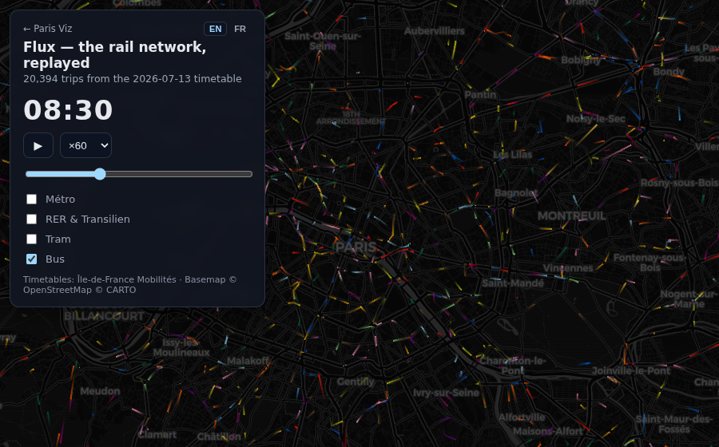

# `/flux` - the transit network in motion

Every scheduled trip of the Île-de-France network moving on the map over one
service day: ~20,000 métro / RER / Transilien / tram trips as glowing comets
(deck.gl TripsLayer, official line colors, real track geometry from
`shapes.txt`), plus **90,000 bus trips** as an opt-in fourth mode.

## Using it

- Play/pause, playback speed, and a time slider over the full service day.
- Day-type selector: weekday, Saturday, Sunday (three separately built days).
- Hover a train for its line; click a line chip to solo that line, click
  again to restore.
- URL params: `?modes=metro,tram,bus&t=30600&paused=1&speed=120`
  (`t` in seconds since midnight).

## How it is built

`pnpm build:flow` (`apps/site/scripts/build-flow-data.ts`) downloads the IDFM
GTFS feed and emits three representative days: the next Monday, Saturday and
Sunday (at least 3 days out, so a fresh feed always covers them). The
expensive pass over `stop_times.txt` (>1 GB uncompressed) runs once over the
union of the three days' trips; emission then filters per day. Rail paths
follow `shapes.txt` geometry, simplified with a ~11 m tolerance.

## Data artifacts

`public/flow/<day>/` for day in `weekday|saturday|sunday`:

- `metro|rail|tram.{bin,json}` - float32 timestamped waypoints along
  shape-following paths, lazy-loaded per mode (~15 MB total).
- `bus.json` + `bus-<hour>.bin` - buses are 10x the trips, so they use a
  tighter format: straight stop-to-stop paths, uint16-quantized positions
  (~4 m grid), 2-second time steps, one chunk per start hour. ~12 MB for the
  whole day, of which the page only ever holds a 3-hour sliding window
  (~1.5 MB).
