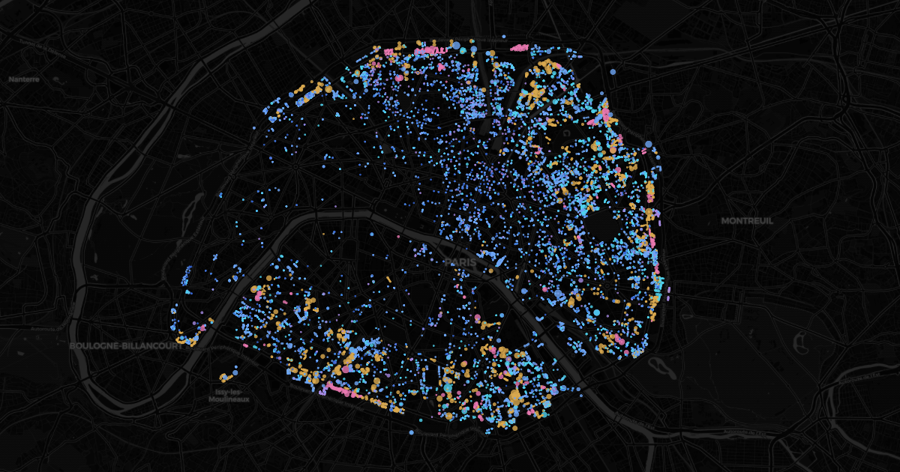

# `/logis` - where social housing is

Live: [parisviz.com/logis](https://parisviz.com/logis)

Every address of the Paris social-housing stock (248,447 dwellings on
January 1st, 2025) as a dot sized by its dwelling count and colored by
financing family: rose for the HBM of 1894-1953 (the brick belt on the
razed fortifications), ochre for the other pre-1977 regimes, then a ladder
of blues from the most subsidized (PLAI, deep blue) through the standard
PLUS to the near-market PLS/PLI (cyan), violet for the residual codes.
Press play and the stock assembles year by year; the map is heavily
east-heavy, and the belt reads as a ring by 1935.

## Using it

- Play/pause and a slider sweep the years on a piecewise timeline
  (1600-2026, dense where Paris actually built); at each year the map
  shows today's stock already present.
- The year dimension select switches the sweep between "built in"
  (construction year) and "first let in" (first letting as social
  housing): the same stock tells two different stories.
- The legend rows are the financing filter: click one to keep only that
  family, click it again to show everything, hover a row for what the
  family means; `?finan=hbm` opens straight on the pink belt.
- The story button pins 1935, when the HBM belt closes around the city;
  pinned there, it offers today's full stock.
- Hover a dot for its dwelling count, financing family, arrondissement,
  construction year, first-letting year when it differs, average size and
  modal DPE; student residences are flagged.
- URL params: `?t=27&mode=let&finan=hbm&paused=1` (`t` in timeline units,
  0-90; 27 = 1940, 60 = 1990).

## What the sweep shows, honestly

By construction year the stock looks old (median 1970), but that is the
age of the buildings, not of the social stock: switch to "first let in"
and the median jumps to 1988, with the 2000s and 2010s as the two biggest
decades. A quarter of the dwellings entered service more than twenty
years after their construction - ordinary buildings bought and
conventioned, the main way Paris has grown its stock since the SRU law
(2000) pushed it toward 25% social housing. 35% of today's stock was
first let after 2000.

The open RPLS file carries no rent and no landlord identity, so the map
shows where and what kind, never how much. About 0.9% of dwellings lack
coordinates and are left off the map (stated in the legend). Financing
codes are grouped into six families; "first let" dates for the oldest
acquisitions are the register's own, sometimes reconstructed. Dwellings
of one program share one geocoded point: dots mark addresses, and the dot
area carries the count.

## How it is built

`pnpm build:logis` (`apps/site/scripts/build-logis-data.ts`) downloads
the SDES RPLS dwelling-level file through the DiDo API with a server-side
row filter (`DEP_CODE=eq:75`) and column selection, so the download is
~25 MB instead of the 5.4M-row national CSV. It converts Lambert-93
coordinates to WGS84 (inverse conic, checked to millimeters against the
BAN geocoder), maps the 15 financing codes onto 6 display families, and
aggregates dwellings into per-address groups keyed by position, years and
family: 250k rows become 21k dots. The vintage is pinned in the script
(`MILLESIME`); bump it when the next annual RPLS lands.

On the client the whole stock is one deck.gl ScatterplotLayer fed binary
attributes; the year sweep, the mode switch and the financing filter are
a three-dimensional `DataFilterExtension` range, i.e. GPU uniforms, so
the 21k dots upload exactly once. The categorical palette is
CVD-validated on the dark basemap (worst adjacent pair ΔE 16.3), with
identity carried by the legend and tooltips beyond color.

## Data artifacts

`public/logis/`:

- `meta.json` - millesime, dwelling and group counts, per-family counts,
  year ranges and medians, share first let since 2000.
- `groups.bin` (~0.4 MB), little-endian:
  - header: magic `LOGI`, group count, float64 bbox
  - per group: uint16 x, y (quantized to the bbox, same frame as
    vertige/strates/mirage), construction year, first-letting year,
    dwelling count, mean surface (m² x 10); uint8 mean rooms (x 10),
    financing family, arrondissement, modal DPE, student flag
---

[← All visualizations](../README.md) · See also: [Flux](flux.md) · [Respire](air.md) · [Horizon](horizon.md) · [Vertige](vertige.md) · [Strates](strates.md) · [Mirage](mirage.md) · [Crue](crue.md) · [Canicule](canicule.md) · [Relief](relief.md) · [Noctilien](noctilien.md)
