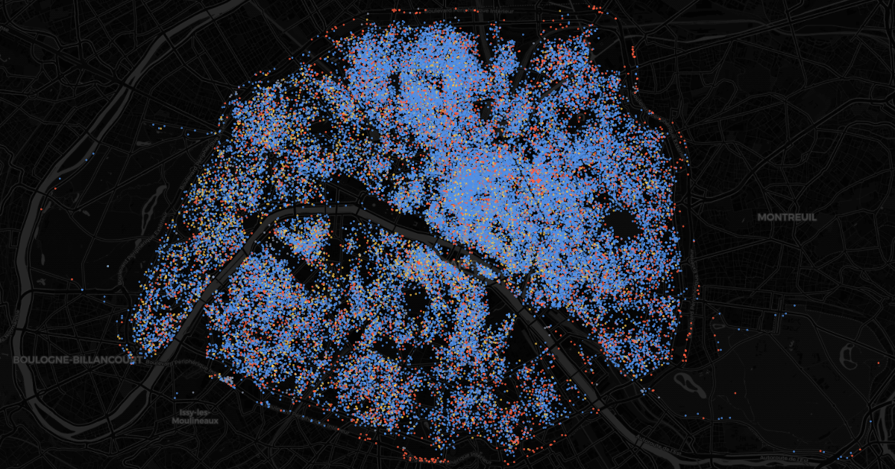

# `/mirage` - the tourist flats

Live: [parisviz.com/mirage](https://parisviz.com/mirage)

Every Airbnb listing of Paris intra-muros (~78,000) as a dot at its
(blurred) place, colored by the registration status the host displays:
steel blue for the 68% showing a well-formed 13-character city number,
vermilion for the 19% without one, gold for mobility leases, slate for
hotel-type listings. Press play and today's stock assembles by first
review date: a trickle through the 2010s, then the post-2022 flood - half
of the current listings first appeared after August 2023.

## Using it

- Play/pause and a slider sweep the months from January 2010 to the scrape
  date; at each month the map shows today's listings whose first review
  predates it.
- The legend rows are the status filter: click one to keep only those
  listings, click it again to show everything, and hover a row for what
  the status means; `?statut=sans` opens straight on the unregistered
  listings.
- The story button pins the median arrival month (August 2023 on the June
  2026 scrape): half of today's tourist flats do not exist yet. Pinned
  there, it offers the completed tide.
- Hover a dot for its room type, host portfolio size, status, quarter,
  first-review month, review count and nightly price.
- URL params: `?t=283&statut=sans&paused=1` (`t` in months since
  January 2000; 283 = August 2023).

## What the sweep shows, honestly

The scrape contains only listings visible on Airbnb at the scrape date, so
the sweep shows when today's stock arrived, not the market's past size:
flats delisted before the scrape have left the data entirely (the
2015-2019 market was much larger than the thin early frames suggest).
Dates are proxied by reviews - a listing "arrives" at its first review -
and the 20% never reviewed join only at the snapshot date. Positions are
blurred by Airbnb by up to 150 m, so dots mark blocks, not doors.

The status is whatever the host displays in the license field: a
well-formed registration number (a Paris arrondissement INSEE code
75101-75120 plus eight characters, or a petite couronne commune for
boundary cases) counts as declared, with no check that the number is real
or theirs; obvious fantasies (7512345678902, 7598765432100) count as none.
Paris has required the number since December 2017 for most short-term
rentals; mobility leases (30-90 nights) and hotel-type listings are
exempt.

## How it is built

`pnpm build:mirage` (`apps/site/scripts/build-mirage-data.ts`) downloads
the Inside Airbnb detailed listings file for Paris (~41 MB gzipped CSV, CC
BY 4.0), stream-parses it (descriptions embed newlines, so a real RFC 4180
parser), classifies each license string, and packs one dot per listing:
quantized position (same frame as vertige and strates), first and last
review month, review count, host portfolio size, nightly price, status,
room type and arrondissement. The scrape date is pinned in the script
(`SNAPSHOT`); bump it to adopt a newer quarterly scrape.

On the client the whole stock is one deck.gl ScatterplotLayer fed binary
attributes; the month sweep and the status filter are a two-dimensional
`DataFilterExtension` range, i.e. GPU uniforms, so the 78k dots are
uploaded exactly once. The median arrival month is computed at parse time
and drives the story button.

## Data artifacts

`public/mirage/`:

- `meta.json` - scrape date, counts by status and room type, month range,
  arrondissement table.
- `listings.bin` (~1.3 MB), little-endian:
  - header: magic `MIRA`, listing count, float64 bbox
  - per listing: uint16 x, y (quantized to the bbox), first and last
    review month (months since January 2000, 0xFFFF = never), review
    count, host listing count, price EUR/night (0 = unknown); uint8
    status, room type, arrondissement index
---

[← All visualizations](../README.md) · See also: [Flux](flux.md) · [Respire](air.md) · [Horizon](horizon.md) · [Vertige](vertige.md) · [Strates](strates.md) · [Crue](crue.md) · [Canicule](canicule.md) · [Relief](relief.md) · [Noctilien](noctilien.md) · [Logis](logis.md)
