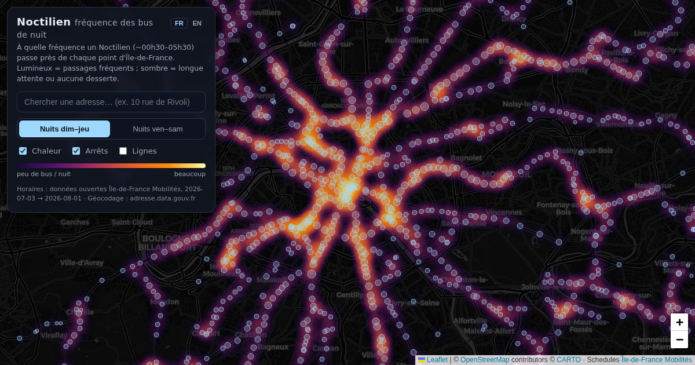

# `/noctilien` - night-bus frequency

Live: [paris-viz.vercel.app/noctilien](https://paris-viz.vercel.app/noctilien)

Heatmap of Noctilien night-bus service (~00:30-05:30): departures per night
around every stop, so you can see which neighbourhoods are served after
midnight and which are not. Migrated from the
[standalone repo](https://github.com/lematty/noctilien) with its full git
history.

## Using it

- Weeknight (Sun-Thu evenings) vs weekend night (Fri-Sat evenings) toggle.
- Address search (Base Adresse Nationale geocoding) with nearest stops and
  walking times; click a line to highlight its route.
- The URL hash restores the exact view:
  `#map=13/48.859/2.347&night=weekend&line=N12&q=address@48.85,2.36`.

## How it is built

`pnpm build:noctilien` (`apps/site/scripts/build-noctilien-data.ts`) scans
the IDFM GTFS feed for Noctilien routes (`N` + two or three digits;
single-digit N1/N2 belong to the airport shuttle network) over the feed's
~30-night window. Departures are attributed to the evening they belong to
(times before noon count toward the previous night), stop poles under the
same name within 150 m are clustered, and each stop gets departures per
night and an average headway for both night types. Route polylines take the
most-used shape per direction, simplified. The heatmap compresses the
hub-to-branch dynamic range with a square root so suburban service stays
visible next to the big hubs.

## Data artifacts

`public/noctilien.json` (~640 KB) - generation date, feed window, night
counts, clustered stops (position, lines, per-night stats) and route
polylines.
---

[← All visualizations](../README.md) · See also: [Flux](flux.md) · [Respire](air.md) · [Horizon](horizon.md) · [Vertige](vertige.md) · [Strates](strates.md) · [Canicule](canicule.md) · [Relief](relief.md)
